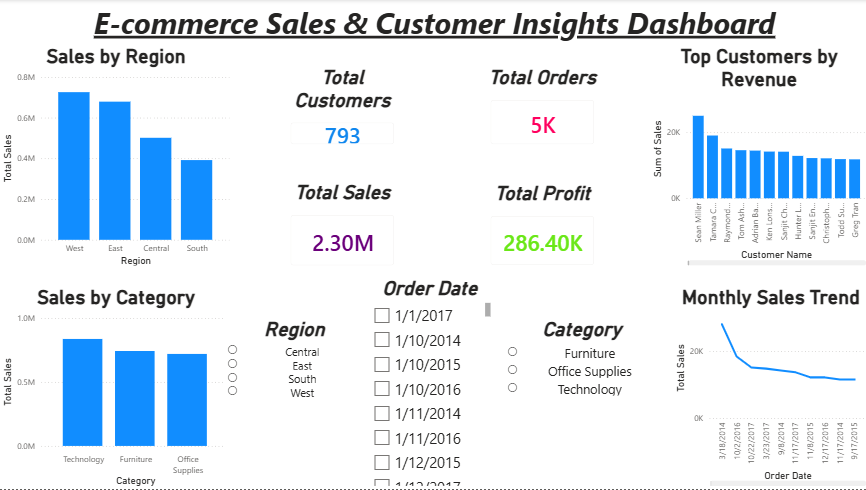

# 🚀 E-commerce Sales & Customer Insights Dashboard

## 👤 Author

**Garv Miglani**
📌 Data Analyst | Business Analytics Enthusiast

---

## 📊 Project Overview

This project focuses on analyzing e-commerce sales data to uncover key business insights and support data-driven decision-making. It demonstrates an end-to-end analytics workflow, from data cleaning to interactive dashboard creation.

---

## 🎯 Objectives

* Analyze sales performance across regions and product categories
* Identify high-value and loyal customers
* Track revenue, profit, and order trends
* Provide actionable business recommendations

---

## 🧰 Tools & Technologies

* 🐍 Python (Pandas, NumPy)
* 📊 Power BI
* 📑 Excel

---

## ⚙️ Key Features

* ✔ Data Cleaning & Preprocessing
* ✔ Feature Engineering (Profit Margin, KPIs)
* ✔ Exploratory Data Analysis (EDA)
* ✔ RFM Customer Segmentation
* ✔ Interactive Power BI Dashboard

---

## 📈 Key Insights

* Technology category generates the highest sales
* West region is the top-performing region
* A small group of customers contributes to the majority of revenue
* Sales trends show fluctuations over time

---

## 💡 Business Recommendations

* Focus marketing efforts on high-value customers
* Optimize pricing strategies for better profitability
* Improve performance in underperforming regions
* Leverage seasonal trends for targeted campaigns

---

## 🖼️ Dashboard Preview


---

## 📁 Project Structure

```
Ecommerce-Sales-Analysis/
 ├── data/
 ├── notebook/
 ├── dashboard/
 ├──images/
 ├── README.md
```

---

## 🚀 Conclusion

This project highlights how data analytics can be leveraged to extract meaningful insights and support strategic business decisions. It reflects real-world analytical thinking and problem-solving skills.

---

## 🔗 Connect with Me

💼 LinkedIn: *https://www.linkedin.com/in/garv-miglani-a62919236/*
📧 Email: *miglanigarv2004@gmail.com*

---
